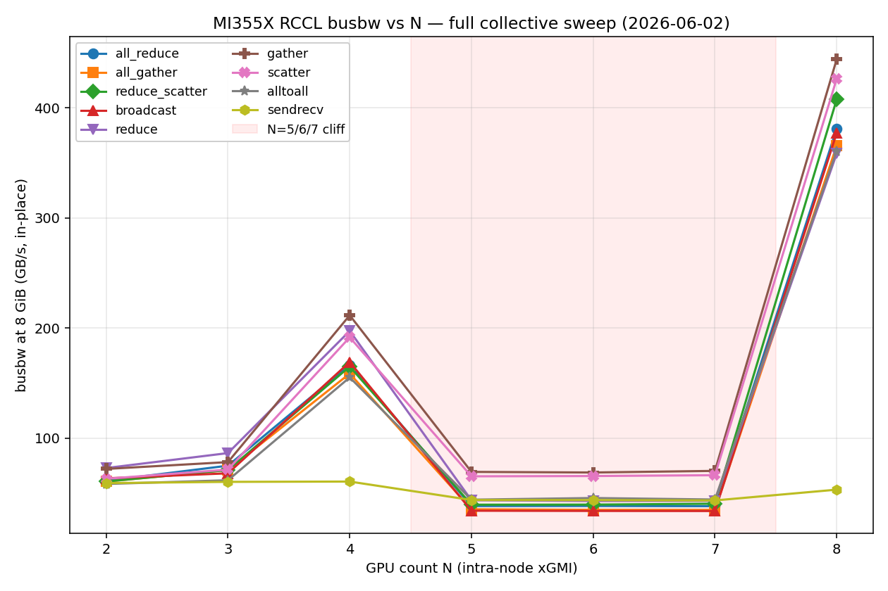

# RCCL Collective Communications — Reference & Analysis

This document inventories every RCCL collective primitive: what it does, its bandwidth model, which RCCL algorithms back it, what Megatron-LM uses it for, and (where we have measured data) the observed performance on this MI355X node.

The N=5/6/7 cliff, mesh-vs-switched-fabric topology, and AMD generation-wide recommendations are covered separately in [summary-power2.md](summary-power2.md). This file does not repeat that material.

---

## 1. Measured results and analysis

### 1.1 Full collective sweep (`logs/rccl_all_20260602_121713/`, `log.nccl-all`)

The all-collective rccl-tests sweep on this MI355X node, June 2, 2026. Config: message sizes 16 MiB → 8 GiB (powers of 2, factor=2), warmup=5, iters=20, `NCCL_ALGO=Ring,Tree`, `NCCL_PROTO=Simple,LL,LL128`, `RCCL_MSCCL_ENABLE=1`, single-node intra-xGMI. All numbers below are **busbw (GB/s) at the 8 GiB top-end message size**, in-place column from the rccl-tests output.

| Collective       |    N=2 |    N=3 |     N=4 |    N=5 |    N=6 |    N=7 |     N=8 |
|------------------|-------:|-------:|--------:|-------:|-------:|-------:|--------:|
| all_reduce       |  61.28 |  75.02 |  166.48 |  38.36 |  38.42 |  38.21 |  381.27 |
| all_gather       |  60.58 |  71.09 |  158.72 |  35.41 |  34.90 |  34.85 |  365.75 |
| reduce_scatter   |  60.65 |  71.04 |  165.06 |  39.57 |  39.65 |  40.47 |  407.69 |
| broadcast        |  63.52 |  68.09 |  169.19 |  34.10 |  33.92 |  33.83 |  377.27 |
| reduce           |  72.87 |  86.46 |  197.44 |  43.60 |  42.93 |  43.08 |  358.49 |
| gather           |  72.07 |  78.27 |  211.64 |  69.38 |  68.83 |  70.29 |  444.15 |
| scatter          |  63.11 |  71.48 |  191.63 |  65.35 |  65.61 |  66.36 |  426.40 |
| alltoall         |  58.40 |  61.79 |  155.21 |  44.14 |  45.62 |  44.26 |  360.90 |
| sendrecv¹        |  59.21 |  60.32 |   60.59 |  43.83 |  43.77 |  43.44 |   53.24 |

¹ The sendrecv row was captured by a follow-on standalone sweep (`logs/rccl_sendrecv_20260602_153246/`, `log.nccl-sendrecv`) on the same env stack and message envelope.

The shaded band highlights the N=5/6/7 cliff: every ring-based collective collapses ~4–5× from N=4 and snaps back at N=8 when all four xGMI channels reactivate. Sendrecv stays flat (single-link rate) and does not recover at N=8. Gather/scatter degrade only ~2× across the cliff because they ride pairwise sendrecv loops rather than a closed ring.

**AllToAllV** is intentionally omitted from the table: at N=2/3/4 the busbw at 8 GiB measured 58.16 / 34.66 / 115.88 GB/s (30–35 % below the equal-chunk AllToAll at the same N, with N=3 anomalously low — likely a per-rank chunk-alignment artifact); N=5 was OOM-killed (`rc=137`) before reaching 8 GiB, only sizes ≤128 MiB produced numbers (peak ~12.7 GB/s busbw); N=6 was truncated mid-run; N=7/8 never ran — see §1.4.

#### 1.1.1 Patterns visible across the matrix

- **The N=5/6/7 cliff is universal across the bandwidth-bound collectives.** Every collective whose busbw model has a `(N-1)/N` or `2(N-1)/N` factor — all_reduce, all_gather, reduce_scatter, broadcast, reduce, alltoall — collapses ~4–5× between N=4 and N=5 and stays flat at N=6/7 before snapping back at N=8. This confirms the topology-driven analysis in [summary-power2.md](summary-power2.md): the K_8 xGMI mesh has a clean factor-of-N ring only at the power-of-2 GPU counts {2, 4, 8}; at N ∈ {5, 6, 7} RCCL falls back to a path that loses one of the four xGMI channels and the resulting busbw is set by the slowest link rather than the aggregate bisection.
- **Gather and Scatter do *not* show the cliff at N=5/6/7.** They drop only ~2× across the cliff vs. ~4–5× for the ring-based collectives. Reason: both are implemented as pairwise sendrecv loops to/from the root rank, which doesn't depend on a complete ring being available. Their bandwidth at N=5–7 is set by the single root-to-peer link rather than the global ring composition.
- **Reduce > AllReduce at every N.** Expected: Reduce only does the reduce phase, AllReduce additionally broadcasts. The ratio is ~1.2× at N=2 and grows toward the `~2×` ratio that the analytic model predicts for very wide rings.
- **AllReduce ≈ ReduceScatter ≈ AllGather at the same N**, within 5–15 %. The Ring AllReduce really is ReduceScatter+AllGather, so its busbw matches the slower of the two halves. This was the prediction in §2.2.3 and the sweep confirms it.
- **Broadcast ≈ Reduce, both > AllReduce.** Single-direction primitives saturate the fabric without the second "fold-back" pass.
- **AllToAll tracks AllGather closely at large N** (N=8: 360.9 vs 365.8 GB/s; N=4: 155.2 vs 158.7 GB/s). At small N it drops below — likely the pairwise sendrecv path is less efficient at N=2/3 than the dedicated Ring AllGather.
- **AllToAllV is 30–35 % slower than AllToAll at the same N** for the configurations that completed (N=2: 58 vs 58 GB/s; N=3: 35 vs 62 GB/s; N=4: 116 vs 155 GB/s). The variable-chunk path has noticeably more per-call overhead. N=3 is unusually bad — likely the per-rank chunk sizing falls out of an alignment window.
- **N=8 gather/scatter are the all-time peaks of the matrix.** Gather hits 444 GB/s and scatter hits 426 GB/s, both above the 381 GB/s AllReduce N=8 peak. Pairwise sendrecv to/from a single root at full xGMI rate is the cleanest way to saturate the fabric on this topology when the result-aggregation pattern fits.
- **SendRecv has a much milder N=5/6/7 cliff than the ring-based collectives** — ~28 % drop (60 → 43 GB/s) vs ~76 % drop (167 → 38 GB/s) for AllReduce. Reason: `sendrecv_perf` exercises a single point-to-point ring where every rank does one send and one recv at a time, so the busbw is set by the *slowest single hop* in the ring rather than by aggregate ring bisection. At N=5/6/7 one pair lands on a slower indirect path; at N=2/3/4 every pair has a direct xGMI link (~60 GB/s, the single-link xGMI rate).
- **SendRecv at N=8 does *not* snap back to a high peak** (53 GB/s, below the N=2..4 plateau). Unlike Ring AllReduce — which at N=8 reactivates all four xGMI channels in parallel and recovers to 381 GB/s — sendrecv has no opportunity to multiplex channels: per-pair traffic uses one link, and the ring closure on the K_8 mesh forces one hop onto a longer path. This is the predicted ceiling for **pipeline-parallel SendRecv** throughput: ~60 GB/s per stage-to-stage exchange at PP=2/4, dropping to ~53 GB/s at PP=8.

### 1.2 Infinity Fabric paper spec vs measured ceilings

This node is 8 × `AMD Instinct MI355X` (gfx950, 256 CUs/die, confirmed via `amd-smi static -a`). Each GPU has **7 xGMI / Infinity Fabric links** wired point-to-point to the other 7 GPUs (the K₈ mesh confirmed by `amd-smi topology` — every off-diagonal cell is XGMI, weight 15, 1 hop). On-node bandwidth telemetry (`amd-smi topology` NUMA BW table and `rocm-smi --shownodesbw`) reports `0-0`/`N/A` on this driver build, so the paper numbers below come from AMD's MI350-series published peaks:

| Quantity                                          | Spec (per paper)        |
|---------------------------------------------------|-------------------------|
| Per xGMI link, **bidirectional**                  | **153.6 GB/s**          |
| Per xGMI link, per direction                      | 76.8 GB/s               |
| Per-GPU aggregate IF BW, **bidirectional** (×7 links) | **1075.2 GB/s**     |
| Per-GPU aggregate IF BW, per direction            | 537.6 GB/s              |

rccl-tests `busbw` is steady-state bytes crossing the wire per unit time. The comparable spec depends on what fraction of the GPU's links is active:

| Measurement (busbw, GB/s, 8 GiB)                       | Compare against (per direction)        | Achieved |
|---------------------------------------------------------|----------------------------------------|---------:|
| SendRecv N=2 — single direct xGMI link                  | 76.8 GB/s (1 link, 1 direction)        | **77 %** |
| SendRecv N=2..4 plateau (~60 GB/s)                      | 76.8 GB/s                              | 77–82 %  |
| AllReduce N=8 — 381 GB/s (Ring across all 7 links)      | 537.6 GB/s (per-GPU aggregate, 1 dir)  | **71 %** |
| ReduceScatter N=8 — 408 GB/s                            | 537.6 GB/s                             | 76 %     |
| Gather N=8 — 444 GB/s (highest in matrix)               | 537.6 GB/s                             | **83 %** |
| Scatter N=8 — 426 GB/s                                  | 537.6 GB/s                             | 79 %     |
| AllReduce N=4 — 166 GB/s                                | ~307 GB/s (4 ranks × ~half links live) | ~54 %    |
| AllReduce N=5/6/7 cliff — ~38 GB/s                      | 537.6 GB/s                             | **~7 %** |

Reading:

- **Single-link efficiency is ~77 %** of the spec — clean and consistent across the small-N sendrecv plateau. The remaining ~23 % is RCCL kernel overhead + xGMI protocol framing, broadly in line with what NCCL/NVLink shows on H100/H200.
- **Ring AllReduce at N=8 hits 71 % of the per-GPU aggregate IF ceiling.** This is the realistic upper bound for DP-grad sync on this server: a Megatron run cannot do better than ~381 GB/s on a fully populated K₈, no matter how the dist-opt is tuned.
- **Pairwise-sendrecv collectives (Gather/Scatter) at N=8 are the closest to silicon: 79–83 % of aggregate.** They route directly to/from one root over many concurrent links without needing a closed ring, so they avoid the ring-balance overhead.
- **The N=5/6/7 cliff caps utilization at ~7 % of fabric peak.** Two-orders-of-magnitude headroom is being thrown away on the floor by RCCL's lack of a valid ring construction at those arities — this is the single largest gap between paper and measured on this server.

### 1.3 Cross-check against Megatron-LM application timers

The Megatron sweeps ([summary.md](summary.md)) report two collective-bearing timers at iter 45:

- `all-grads-sync` — ReduceScatter + the kernel-level reduce. Bounded by ReduceScatter bandwidth.
- `params-all-gather` — straight AllGather of the post-step parameters.

Comparison at the N=4 → N=5 transition (relative slowdown):

| Timer / collective                       | N=4 → N=5 ratio  |
|------------------------------------------|------------------:|
| Megatron `all-grads-sync`                | 4.06×             |
| Megatron `params-all-gather`             | 4.67×             |
| rccl-tests `all_reduce` busbw            | 4.37× (slower)    |
| rccl-tests `all_gather` busbw            | 4.50× (slower)    |

Application-level slowdowns track collective-level slowdowns within ±10 %. The rccl-tests measurements are a faithful predictor of the Megatron timer values at this configuration.

### 1.4 Remaining coverage gap

| Collective       | Status                                                              | Why it matters here                                                                       |
|------------------|---------------------------------------------------------------------|-------------------------------------------------------------------------------------------|
| AllToAllV (N≥5)  | OOM-killed at N=5; user opted to skip retries                       | Per-rank buffer × N replicas grows past device memory at 8 GiB / N≥5; would need smaller `--maxbytes` or per-N scaling. AllToAll (with equal chunks) is fully measured and bounds AllToAllV from above. |
| Multi-node       | Not exercised here (intra-node xGMI only)                            | IB / RoCE bandwidth would be the bottleneck once the collective crosses the node boundary. |
| Sub-MiB messages | Sweep starts at 16 MiB; small-message latency regime not probed     | Where Tree algorithms become competitive with Ring.                                       |

---

## 2. Reference — collectives, algorithms, knobs

### 2.1 Catalog of RCCL collectives

| Collective       | Op semantics                                              | `busbw` formula        | Megatron-LM usage                                                            | rccl-tests binary           | Tested |
|------------------|-----------------------------------------------------------|------------------------|------------------------------------------------------------------------------|------------------------------|--------|
| **AllReduce**    | reduce-then-broadcast; every rank ends with `op(x_0..x_{N-1})` | `algbw × 2·(N-1)/N` | DP grad sync (no dist-opt); TP fwd/bwd; tied-embedding sync                  | `all_reduce_perf`            | Yes    |
| **AllGather**    | each rank publishes `S/N`; all end with full vector       | `algbw × (N-1)/N`      | Dist-opt param all-gather; FSDP / ZeRO-3 param gather                        | `all_gather_perf`            | Yes    |
| **ReduceScatter**| reduce, then each rank keeps its `1/N` slice              | `algbw × (N-1)/N`      | Dist-opt grad reduce-scatter; FSDP / ZeRO-2 grad reduce                       | `reduce_scatter_perf`        | Yes    |
| **Broadcast**    | root sends one buffer to all                              | `algbw × 1`            | Init param sync; checkpoint load; PP stage broadcast                          | `broadcast_perf`             | Yes    |
| **Reduce**       | every rank contributes; only root keeps result            | `algbw × 1`            | Per-step loss reduce to rank 0 for logging                                    | `reduce_perf`                | Yes    |
| **Gather**       | concatenate every rank's buffer on root                   | `algbw × (N-1)/N`      | Validation / debug paths                                                      | `gather_perf`                | Yes    |
| **Scatter**      | root's `N·S` buffer split, one slice per rank             | `algbw × (N-1)/N`      | Rarely used directly                                                          | `scatter_perf`               | Yes    |
| **AllToAll**     | rank `i` sends chunk `j` to rank `j`                      | `algbw × (N-1)/N`      | MoE expert token routing; TP token reshuffles                                 | `alltoall_perf`              | Yes    |
| **AllToAllV**    | AllToAll with per-peer variable chunk sizes               | `algbw × (N-1)/N`      | MoE with imbalanced token counts                                              | `alltoallv_perf`             | N≤4    |
| **SendRecv**     | point-to-point pair                                       | `algbw × 1`            | PP stage-to-stage activations and gradients                                   | `sendrecv_perf`              | Yes    |

`busbw` is steady-state per-link traffic; `algbw` is bytes / wall time. AllReduce moves ~2× the wire traffic of AllGather at the same `busbw`.

### 2.2 Megatron-LM critical-path notes

- **AllReduce** — off-critical-path in current `run.sh` (TP=1, dist-opt on, embeddings untied); dist-opt replaces it with ReduceScatter + AllGather.
- **AllGather / ReduceScatter** — the two halves of every DP comm step with `--use-distributed-optimizer`. ReduceScatter first (grad reduce, keep `1/N` slice), AllGather second (broadcast updated params).
- **Broadcast / Reduce** — init and logging only; off the steady-state critical path.
- **Gather / Scatter** — not on the training path.
- **AllToAll / AllToAllV** — the defining MoE primitive (expert routing across EP). AllToAllV when expert loads are imbalanced.
- **SendRecv** — pipeline-parallel stage transfers. Unused in current `run.sh` (PP=1); becomes dominant at PP≥2.

### 2.3 RCCL algorithm selection

| Collective       | Ring          | Tree              | PAT       | MSCCL          | Pairwise sendrecv |
|------------------|---------------|-------------------|-----------|----------------|-------------------|
| AllReduce        | Default large | Default small (degraded on mesh) | — | If plan exists | — |
| AllGather        | Default       | Falls back to Ring | Available | If plan exists | — |
| ReduceScatter    | Default       | Falls back to Ring | Available | If plan exists | — |
| Broadcast        | Default large | Default small     | —         | —              | — |
| Reduce           | Default large | Default small     | —         | —              | — |
| Gather / Scatter | —             | —                 | —         | —              | Default            |
| AllToAll         | —             | —                 | —         | If plan exists | Default            |
| SendRecv         | —             | —                 | —         | —              | Direct             |

- **MSCCL plans** in `/opt/rocm-7.2.3/share/rccl/msccl-algorithms/`: AllReduce (N=8), AllGather (N=16, 32), AllToAll (N=8, multiple message-size bands). Everything else falls through to Ring / pairwise sendrecv.
- **NVLS** (NVSwitch in-network reductions): not applicable on AMD until UALink ships. **PAT**: switched-fabric path, not active on xGMI mesh.
- Forcing `NCCL_ALGO=Tree` on AllGather / ReduceScatter is silently equivalent to Ring.

### 2.4 Configuration knobs

| Variable                  | Default              | Effect                                                                                          |
|---------------------------|----------------------|-------------------------------------------------------------------------------------------------|
| `NCCL_ALGO`               | `Ring,Tree`          | Algorithm pool. `Tree` only affects AllReduce / Broadcast / Reduce.                              |
| `NCCL_PROTO`              | `Simple,LL,LL128`    | Wire protocol; `Simple` ≡ default at large message size on this fabric.                          |
| `RCCL_MSCCL_ENABLE`       | `1`                  | Toggle MSCCL plan dispatch. No measurable effect on this server's bundled plans.                |
| `RCCL_MSCCL_ALGO_DIR`     | `/opt/rocm/share/rccl/msccl-algorithms` | Override MSCCL plan directory.                                                |
| `NCCL_P2P_DISABLE`        | `0`                  | `1` forces host-SHM staging; debug only.                                                         |
| `NCCL_SHM_DISABLE`        | `0`                  | Leave on.                                                                                        |
| `NCCL_IB_DISABLE`         | `0`                  | Set to `1` for intra-node-only runs (as here).                                                   |
| `NCCL_DEBUG`              | `WARN`               | `INFO` prints algorithm + channel count per call.                                                |
| `NCCL_MIN/MAX_NCHANNELS`  | (heuristic)          | Force / cap parallel ring channels. Rarely effective beyond topology limits.                    |
